## A short introduction

::: {.columns}
::: {.column width="43%"}
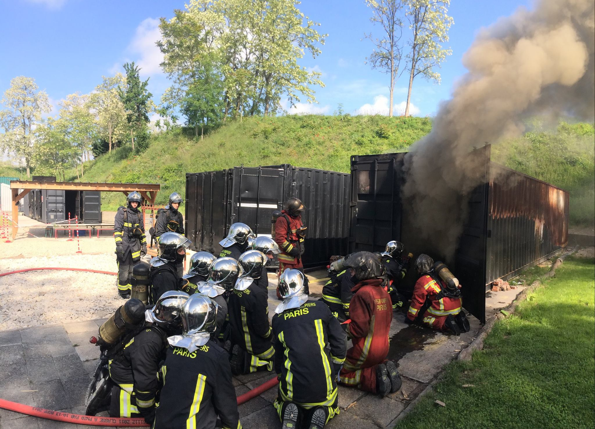{fig-alt="Paris Fire Brigade vehicle" width="94%" fig-align="center"}
:::

::: {.column width="57%"}
::: {.titlebox}
<p class="cardtitle">Why I became interested</p>

**2023** -- internship with the Paris Fire Brigade  
**2024--today** -- regular use in my PhD work

<span class="badge">literature</span>
<span class="badge">code</span>
<span class="badge">debugging</span>
<span class="badge">writing</span>
<span class="badge">slides</span>
:::

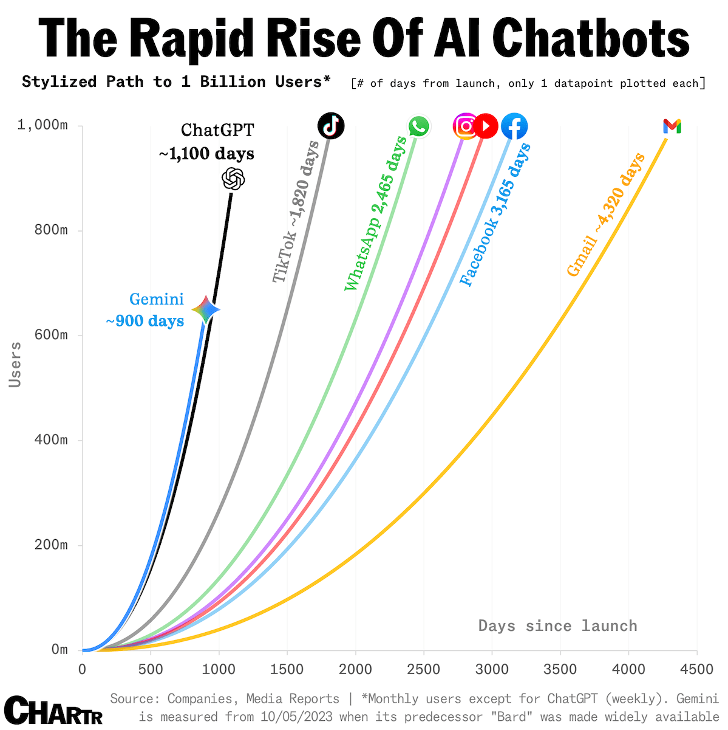{fig-alt="Rise of interest in conversational AI tools" width="38%" fig-align="center"}
:::
:::

## Why I kept using them

::: {.threepics}
::: {.piccard}
{fig-alt="A stack of papers" width="100%"}
<p><strong>Too many papers</strong><br><span class="muted">Find and compare faster</span></p>
:::

::: {.piccard}
{fig-alt="A programmer typing code on a laptop" width="100%"}
<p><strong>Implementation friction</strong><br><span class="muted">Prototype and debug faster</span></p>
:::

::: {.piccard}
{fig-alt="A fictional intelligent assistant" width="100%"}
<p><strong>A useful assistant?</strong><br><span class="muted">Only with human judgement</span></p>
:::
:::

::: {.sources}
Image credits: paper @img_copy_paper; programming photograph @img_computer_programmer.
:::

## Before / after AI agents

::: {.grid2}
::: {.card}
<p class="cardtitle">Before</p>

<p class="phase">Idea -> implementation details -> debugging -> documentation</p>

- Repeated API and syntax searches
- Boilerplate obscures the research question
- Design decisions become hard to recover
:::

::: {.card .aftercard}
<p class="cardtitle">Now, when it works</p>

<p class="phase">Idea -> explicit constraints -> agent loop -> checked results</p>

- I state the objective and invariants
- The agent handles bounded implementation work
- I inspect results and scientific meaning
:::
:::

::: {.call}
The gain is not less thinking. It is spending thinking time at the right level.
:::

## An honest promise

::: {.columns}
::: {.column width="47%"}
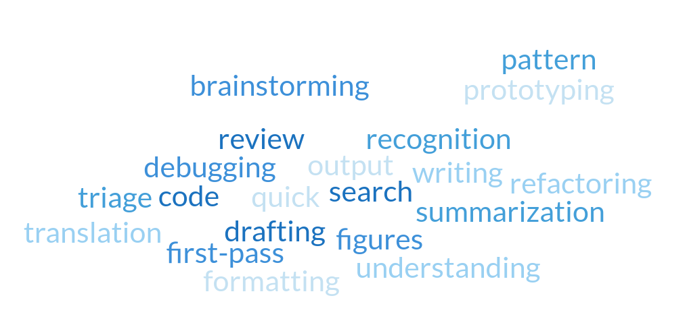{fig-alt="Traits of AI agents: infinite energy, zero shame and uneven reliability" width="100%"}
:::

::: {.column width="53%"}
::: {.titlebox}
<p class="bigline"><strong>An AI agent is like a very fast junior collaborator:</strong></p>

- endless energy,
- no embarrassment about trying,
- uneven reliability.
:::

::: {.call}
Useful for execution and exploration. Scientific originality and judgement remain my responsibility.
:::
:::
:::

## A language model is not an oracle

::: {.columns}
::: {.column width="44%"}
::: {.titlebox}
$$P(\text{token}_t \mid \text{tokens}_{<t})$$

It produces plausible continuations.

**Useful?** Very often.  
**True by default?** No.
:::
:::

::: {.column width="56%"}
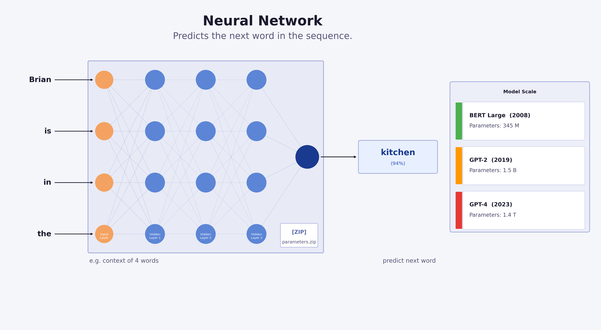{fig-alt="Schematic neural network predicting a token" width="96%" fig-align="center"}
:::
:::

::: {.sources}
Hallucination and evaluation discussion: @openai_hallucinate.
:::

## From chat to AI agent

::: {.columns}
::: {.column width="49%"}
::: {.card}
<p class="cardtitle">Chat</p>
{fig-alt="Prompt followed by answer" width="100%"}

**Question -> response**
:::
:::

::: {.column width="51%"}
::: {.card}
<p class="cardtitle">Agent</p>
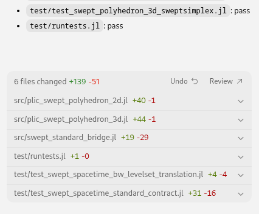{fig-alt="Agent iterating using tools" width="74%" fig-align="center"}

**Goal -> tools -> actions -> results**
:::
:::
:::

## What agents can touch

<div class="agentflow">
<div class="node strong">Your intent</div>
<div class="arrow">-></div>
<div class="node">Files<br><span>papers / code / notes</span></div>
<div class="arrow">-></div>
<div class="node">Tools<br><span>search / shell / tests</span></div>
<div class="arrow">-></div>
<div class="node strong">Results</div>
</div>

<div class="iconrow">
<div><strong>Read</strong><br>documents</div>
<div><strong>Edit</strong><br>code or text</div>
<div><strong>Run</strong><br>scripts and tests</div>
<div><strong>Connect</strong><br>external tools</div>
</div>

::: {.sources}
Tool connections are standardized in part through MCP: @mcp_intro.
:::

## Agents are not only for coding

<div class="fouruses">
<div><span class="useicon">PDF</span><strong>Literature</strong><small>query sources</small></div>
<div><span class="useicon">{ }</span><strong>Software</strong><small>implement, test</small></div>
<div><span class="useicon">fx</span><strong>Numerics</strong><small>run studies</small></div>
<div><span class="useicon">TXT</span><strong>Writing</strong><small>draft, revise</small></div>
</div>

::: {.titlebox .centertext}
My highest-value use is not “write code for me.”  
It is: **help me reach results I can check sooner.**
:::

## The available landscape

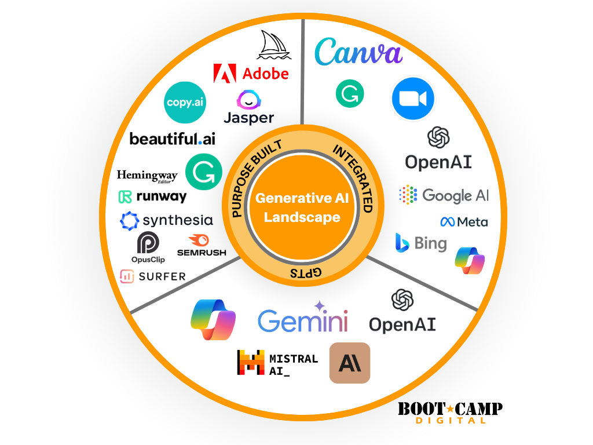{fig-alt="Landscape of generative AI tools and agent products" width="78%" fig-align="center"}

::: {.sources}
Landscape graphic reused from my previous seminar [previous deck, lines 184--190]. The market changes rapidly; this is an orientation slide, not a ranking.
:::

## My survey of available tools {.smaller}

<iframe class="surveyframe" src="handouts/index.html" title="Interactive overview of AI agents and LLM tools"></iframe>

::: {.sources}
Interactive survey prepared for my previous seminar; pricing shown inside is a dated snapshot and should be verified before any decision.
:::

## Documents: source-grounded questions

::: {.columns}
::: {.column width="40%"}
::: {.titlebox}
<p class="cardtitle">Example: NotebookLM</p>

Upload selected sources, then ask focused questions:

**Where do two papers disagree?**  
**Which assumptions define the method?**
:::

::: {.sources}
NotebookLM uses uploaded sources to answer requests: @google_notebooklm_sources.
:::
:::

::: {.column width="60%"}
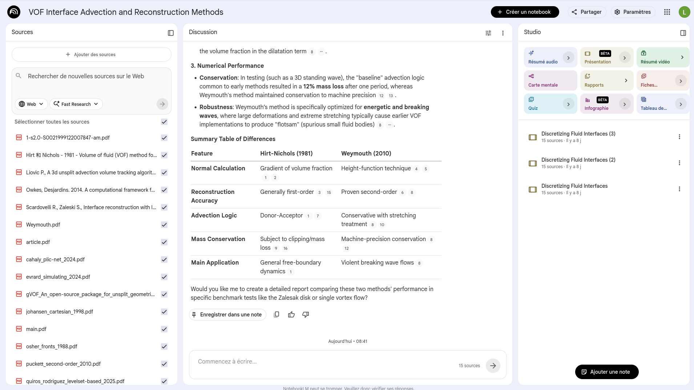{fig-alt="NotebookLM interface using uploaded sources" width="100%" fig-align="center"}
:::
:::

## Code: the loop I use

<div class="agentflow compact six">
<div class="node strong">Clear intent</div>
<div class="arrow">-></div>
<div class="node">Small case</div>
<div class="arrow">-></div>
<div class="node">Agent patch</div>
<div class="arrow">-></div>
<div class="node">Tests</div>
<div class="arrow">-></div>
<div class="node">Review</div>
<div class="arrow">-></div>
<div class="node strong">Iterate</div>
</div>

::: {.titlebox .centertext}
An implementation is cheap. A **validated result** is valuable.
:::

## Clear objective before prompt

::: {.grid2}
::: {.card .badcard}
<p class="cardtitle bad">Blurred request</p>

```text
My simulation is unstable.
Make it work.
```
:::

::: {.card .goodcard}
<p class="cardtitle good">Checkable request</p>

```text
Diagnose mass drift in the static
droplet test. Preserve the scheme.
Find the first failing invariant.
Run the convergence tests.
```
:::
:::

::: {.call}
The clearer I am about the outcome, the less freedom the model has to invent the problem.
:::

## Minimum viable result first

<div class="agentflow compact">
<div class="node strong">One question</div>
<div class="arrow">-></div>
<div class="node">One small case</div>
<div class="arrow">-></div>
<div class="node">One invariant</div>
<div class="arrow">-></div>
<div class="node strong">Iterate</div>
</div>

::: {.titlebox .centertext}
Not “implement the full method.”  
First: **test one flux on one manufactured solution.**
:::

## Detailed prompts are worth it

<div class="promptframe">
<div><strong>Objective</strong><span>what must change?</span></div>
<div><strong>Context</strong><span>which files and references?</span></div>
<div><strong>Constraints</strong><span>what must remain invariant?</span></div>
<div><strong>Test</strong><span>how is success measured?</span></div>
<div><strong>Report</strong><span>which results must be returned?</span></div>
</div>

::: {.call}
A serious prompt may be dozens or hundreds of lines: equations, tests, examples, rejected attempts and expected output.
:::

## The prompt template I use

::: {.small}
```text
Objective
  Add a manufactured-solution convergence test for <equation/method>.

Context to read first
  Read src/<operator>, test/<nearest existing test>, docs/MATH.md.
  Preserve the public API and the existing time integration scheme.

Scientific constraints
  The exact solution is ...
  Evaluate L2 error at refinements [...]. Expected order >= ...
  Do not claim convergence unless the fitted slope satisfies the threshold.

Implementation contract
  Start with a plan. Make the smallest patch. Run <command>.
  If a test fails, diagnose before broadening the edit.

Final response
  List changed files, commands run, numerical results and uncertainty.
```
:::

## Verification stays human-owned

<div class="ladder">
<div><span>1</span>Runs</div>
<div><span>2</span>Regression test</div>
<div><span>3</span>Invariant</div>
<div><span>4</span>Convergence</div>
<div class="human"><span>5</span>Scientific meaning</div>
</div>

::: {.call}
The agent can run checks. I decide whether the result supports a scientific claim.
:::

## Failure modes I encounter

::: {.grid2}
::: {.card .goodcard}
<p class="cardtitle good">Useful failures</p>

- Wrong API name, caught by tests
- Missing import, found immediately
- Large patch, reduced during review
:::

::: {.card .badcard}
<p class="cardtitle bad">Dangerous failures</p>

- Plausible but false derivation
- A fix that changes the numerical problem
- Relaxed tolerance hidden as success
- Unsupported reference or result
:::
:::

::: {.call}
The dangerous errors are plausible. They are precisely why checks and review matter.
:::

## Command review: keeping control

::: {.columns}
::: {.column width="40%"}
::: {.card}
<p class="cardtitle">Example CLI commands</p>

| Command | Use |
|---|---|
| `/init` | create project guidance |
| `/clear` | new independent topic |
| `/compact` | summarize context |
| `/rewind` | undo a bad direction |
| `/help` | discover commands |
:::
:::

::: {.column width="60%"}
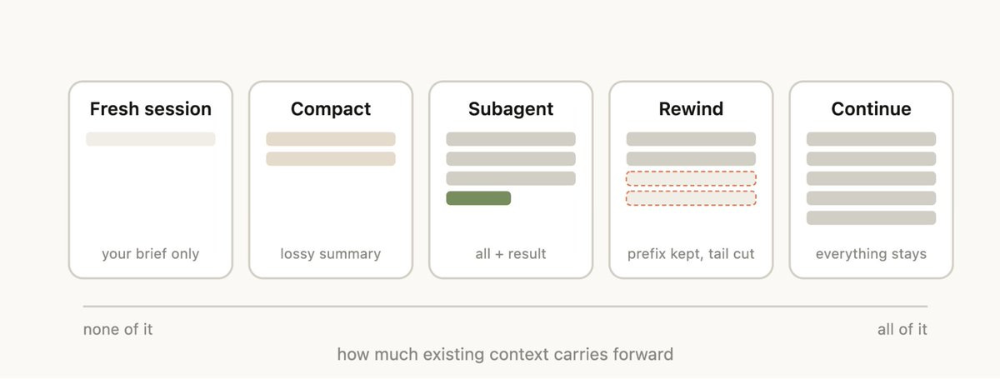{fig-alt="Session-management commands for an AI agent tool" width="100%" fig-align="center"}
:::
:::

::: {.sources}
Command examples originate from my Claude CLI notes; exact commands vary by tool.
:::

## Context is a limited resource

::: {.columns}
::: {.column width="39%"}
::: {.titlebox}
<p class="cardtitle">Context window</p>

An agent sees only the material provided or retrieved in the current working context.

**Do not make it re-read the entire project for every question.**
:::
:::

::: {.column width="61%"}
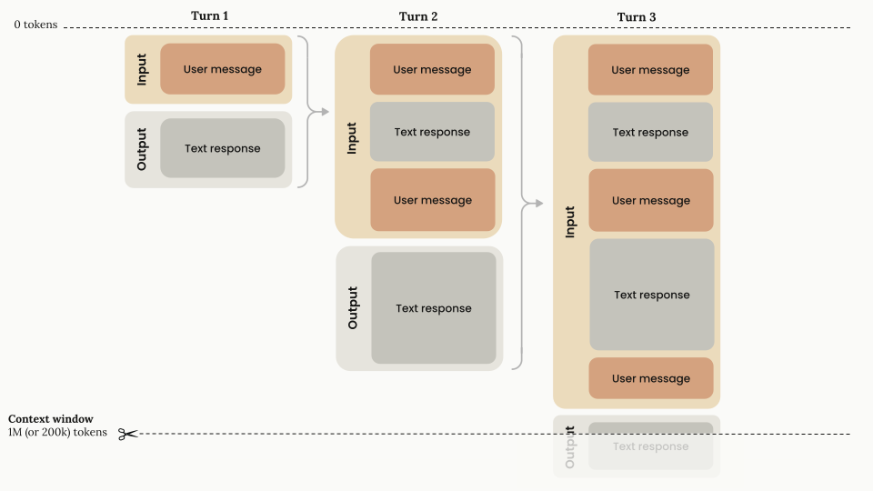{fig-alt="Context window containing only part of project history" width="100%" fig-align="center"}
:::
:::

## Choose effort for the task

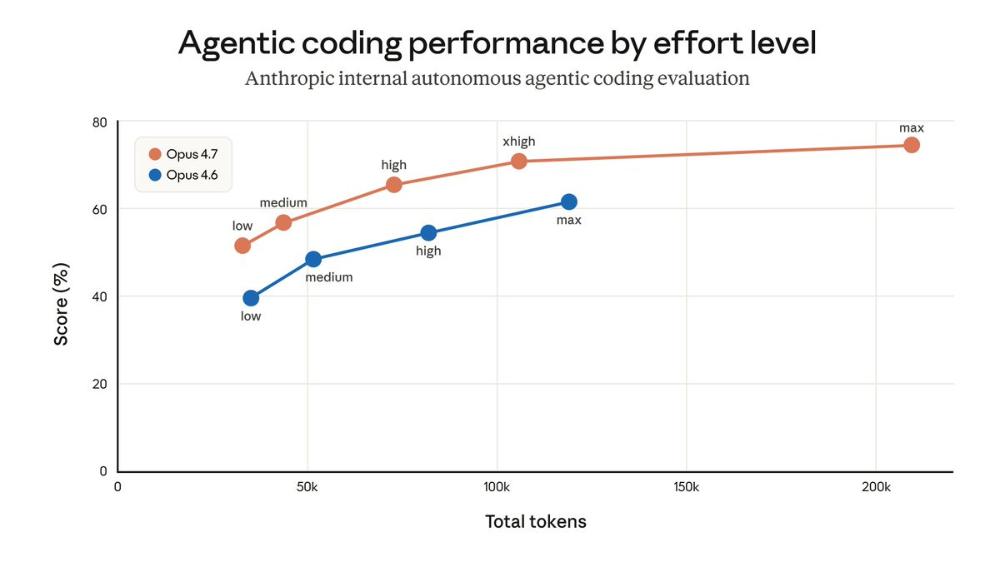{fig-alt="Trade-off between model effort and task complexity" width="78%" fig-align="center"}

::: {.call}
Search and formatting do not require the same reasoning budget as architecture or numerical diagnosis.
:::

## Project memory

::: {.columns}
::: {.column width="43%"}
::: {.titlebox}
<p class="cardtitle">Persistent context</p>

`AGENTS.md`  
build, test, conventions

`MATH.md`  
equations and assumptions

`SKILL.md`  
reusable Julia workflow
:::
:::

::: {.column width="57%"}
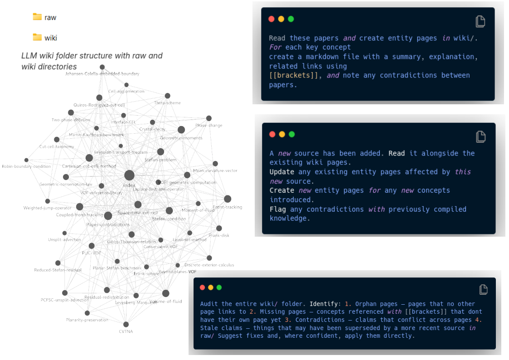{fig-alt="Connected project notes in Obsidian" width="100%" fig-align="center"}
:::
:::

::: {.call}
Files are versioned memory. Tests are executable memory.
:::

## `AGENTS.md`: operating manual for an agent

::: {.columns}
::: {.column width="48%"}
::: {.titlebox}
<p class="cardtitle">In `CartesianGeometry.jl`</p>

`integrate(...)`  
`->` select backend  
`->` compute moments  
`->` return `GeometricMoments`

<span class="badge">`:vofi`</span>
<span class="badge">`:voftools`</span>
<span class="badge">`:implicitintegration`</span>
:::
:::

::: {.column width="52%"}
::: {.card}
<p class="cardtitle">Validation encoded for the agent</p>

- Unit tests per backend
- Explicit-front / level-set consistency
- Mixture-law verification
- Known verification scripts for space-time PLIC
:::
:::
:::

::: {.sources}
Extracted from `CartesianGeometry.jl/AGENTS.md`, lines 1--17, 35--55 and 262--271.
:::

## `MATH.md`: scientific context that persists

::: {.columns}
::: {.column width="49%"}
::: {.titlebox}
<p class="cardtitle">Cut-cell definition</p>

$$V_C = \int_{C \cap \{\phi \le 0\}} dV$$

$$\mathbf{b}_C = \frac{1}{V_C}
\int_{C \cap \{\phi \le 0\}} \mathbf{x}\,dV$$
:::
:::

::: {.column width="51%"}
::: {.card}
<p class="cardtitle">Why give this to an agent?</p>

- Wet / dry sign convention is explicit.
- A cut, full or empty cell is defined.
- VOF reconstruction constraints are recorded.
- Generated code can be checked against the method.
:::
:::
:::

::: {.sources}
Definitions from `CartesianGeometry.jl/MATH.md`, lines 7--44 and 119--157.
:::

## `SKILL.md`: Julia development rules

::: {.columns}
::: {.column width="42%"}
::: {.titlebox}
<p class="cardtitle">Skill metadata</p>

```yaml
name: julia
description: Julia development
  guidelines for scientific code.
```

One reusable instruction set, available across Julia tasks.
:::
:::

::: {.column width="58%"}
::: {.card}
<p class="cardtitle">Instructions given to the agent</p>

- Use multiple dispatch and type-stable code.
- Prefer immutable structs and `SArray` for fixed collections.
- Add docstrings with signatures and return values.
- Test edge cases and type stability.
- Profile with `BenchmarkTools.jl` before optimizing.
:::
:::
:::

::: {.sources}
Example Julia skill supplied for this talk; reusable Codex skills are documented in @openai_codex_skills.
:::

## Hosted models or local open-weight models?

::: {.threechoices}
::: {.titlebox}
<p class="cardtitle">Hosted US services</p>

OpenAI, Anthropic, Google

Easy to access and powerful; material is processed through a provider service.
:::

::: {.card}
<p class="cardtitle">European alternative</p>

Mistral AI

I tested **Codestral**, **Devstral**, and **Mistral Studio**.

Work nice for smaller tasks, but not yet a full replacement for hosted services.
:::

::: {.card .localcard}
<p class="cardtitle">Local open-weight model</p>

More control, but:

**Devstral local, reduced setup:** run on a Mac M3 10 GPUs. 

:::
:::

::: {.sources}
Mistral model and local deployment documentation checked on 27 May 2026: @mistral_coding; @mistral_vibe_local.
:::

## Sovereignty and intellectual property

::: {.columns}
::: {.column width="47%"}
::: {.titlebox}
<p class="cardtitle">Before sending material</p>

**What leaves my machine?**  
**May it be retained or trained on?**  
**Who controls deployment and keys?**
:::
:::

::: {.column width="53%"}
::: {.card}
<p class="cardtitle">A relevant option</p>

Mistral documents that API data is not used for model training and provides self-deployment routes for compatible models.

This does not replace checking project or partner rules.
:::
:::
:::

::: {.sources}
Mistral privacy and deployment documentation: @mistral_privacy; @mistral_self_deployment.
:::

## Takeaways

<div class="fouruses takeaway">
<div><span class="useicon">1</span><strong>Clarify</strong><small>the desired result</small></div>
<div><span class="useicon">2</span><strong>Start small</strong><small>minimum viable result</small></div>
<div><span class="useicon">3</span><strong>Verify</strong><small>tests to meaning</small></div>
<div><span class="useicon">4</span><strong>Own</strong><small>data and claims</small></div>
</div>

::: {.titlebox .centertext}
AI agents do not replace research judgement.  
They can free time for it.
:::

## Discussion

::: {.discussionbox}
**Where could an agent remove friction in your work?**

**What tests or checks would make you trust its output?**

**What data must never leave your control?**
:::

## Useful links

- OpenAI Codex: <https://developers.openai.com/codex>
- GitHub Copilot: <https://docs.github.com/en/copilot>
- Anthropic Claude Code: <https://docs.anthropic.com/en/docs/claude-code>
- Mistral coding models: <https://docs.mistral.ai/capabilities/code_generation/>
- Mistral privacy / deployment: <https://docs.mistral.ai/models/deployment/>
- MCP: <https://modelcontextprotocol.io/docs/getting-started/intro>

## Cited documentation {.smaller}

::: {#refs}
:::
